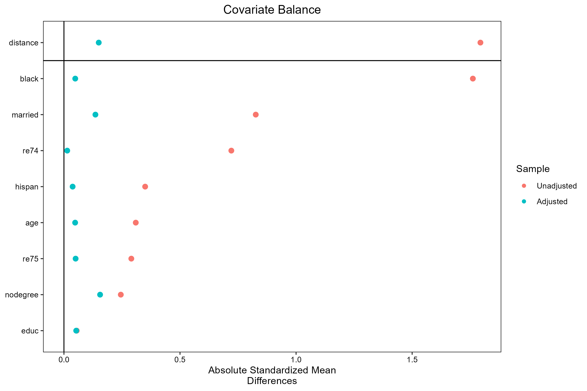

# Causal Inference: Treatment Effect Estimation  
### PSM · IPTW · Doubly Robust · TMLE · Bayesian ATE

This project demonstrates several commonly used causal inference methods for estimating treatment effects from observational (real-world-like) data.  
All analyses were performed using **R**, and results (plots + tables) are included in this repository.

This repository is suitable for:
- Clinical / Pharma **Biostatistics** roles  
- **RWE / RWD causal inference** analyst roles  
- **Epidemiology** and observational study methodology  
- Candidates showcasing **statistical programming** and **causal inference** skill sets

---

## 🔍 Objectives

This project implements four major causal inference approaches:

### **1. Propensity Score Matching (PSM)**  
- Nearest neighbor matching (1:1)  
- Covariate balance diagnostics  
- Love plot  
- ATT estimation  

### **2. IPTW (Inverse Probability of Treatment Weighting)**  
- Propensity score weighting  
- Weighted mean difference (ATE)  
- Balance diagnostics  
- Doubly Robust (DR) estimator via weighted regression  

### **3. TMLE (Targeted Maximum Likelihood Estimation)**  
- Semi-parametric efficient estimator  
- Uses SuperLearner library for nuisance estimation  
- Produces point estimate, CI, and p-value  

### **4. Bayesian Treatment Effect Estimation (brms)**  
- Posterior distribution of ATE  
- Full uncertainty quantification  
- Credible interval and density plot  

---

#  Key Outputs

## **1. Love Plot (PSM Balance Diagnostics)**

> Diagnostics of covariate balance before/after matching.

---

## **2. Bayesian ATE Posterior**

> Posterior distribution of treatment effect estimated using `brms`.

---

## **3. Summary of Treatment Effects (All Methods)**

Final combined results from PSM, IPTW, DR, TMLE, and Bayesian:

📄 **[Download results table](causal_results_summary.csv)**

---

