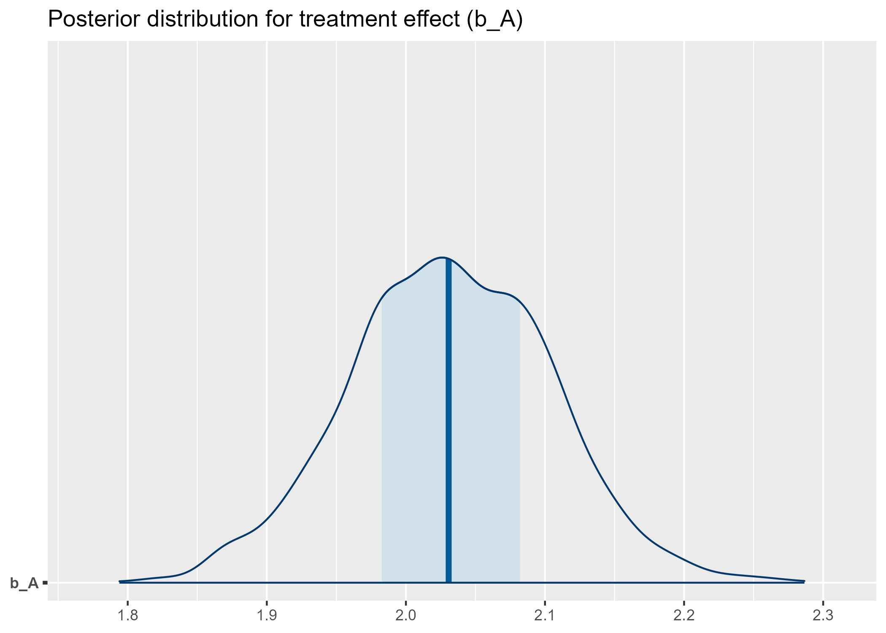

# Causal Inference: Treatment Effect Estimation  
### PSM · IPTW · Doubly Robust · TMLE · Bayesian ATE

This project demonstrates several commonly used causal inference methods for estimating treatment effects from observational (real-world-like) data.  
All analyses were performed using **R**, and results (plots + tables) are included in this repository.

This repository is suitable for:
- Clinical / Pharma **Biostatistics** roles  
- **RWE / RWD causal inference** analyst roles  
- **Epidemiology** and observational study methodology  
- Candidates showcasing **statistical programming** and **causal inference** skill sets

---

##  Objectives

This project implements four major causal inference approaches:

### **1. Propensity Score Matching (PSM)**  
- Nearest neighbor matching (1:1)  
- Covariate balance diagnostics  
- Love plot  
- ATT estimation  

### **2. IPTW (Inverse Probability of Treatment Weighting)**  
- Propensity score weighting  
- Weighted mean difference (ATE)  
- Balance diagnostics  
- Doubly Robust (DR) estimator via weighted regression  

### **3. TMLE (Targeted Maximum Likelihood Estimation)**  
- Semi-parametric efficient estimator  
- Uses SuperLearner library for nuisance estimation  
- Produces point estimate, CI, and p-value  

### **4. Bayesian Treatment Effect Estimation (brms)**  
- Posterior distribution of ATE  
- Full uncertainty quantification  
- Credible interval and density plot  

---

#  Documentation
- [mini SAP](documents/mini_SAP.md)
  

#  Code
- [demo_code.R](code/demo_code.R)

---

#  Key Figures (Visual Outputs)

### **1. Love Plot — Covariate Balance (PSM)**

---

### **2. TMLE ATE Estimate (with 95% CI)**

---

### **3. Bayesian Posterior Distribution (ATE)**

---

#  Detailed CSV Results (Click to view)

| Description | File |
|------------|------|
| PSM Balance Table | [balance_psm.csv](tables/balance_psm.csv) |
| Matched Dataset (PSM) | [matched_data_psm.csv](tables/matched_data_psm.csv) |
| PSM ATT Result | [psm_result.csv](tables/psm_result.csv) |
| IPTW Balance Table | [balance_iptw.csv](tables/balance_iptw.csv) |
| IPTW ATE Result | [iptw_result.csv](tables/iptw_result.csv) |
| Doubly Robust Result | [dr_result.csv](tables/dr_result.csv) |
| TMLE ATE Result | [tmle_result.csv](tables/tmle_result.csv) |
| Bayesian Posterior Samples | [bayes_posterior_samples.csv](tables/bayes_posterior_samples.csv) |
| Bayesian Summary | [bayes_A_summary.csv](tables/bayes_A_summary.csv) |
| Combined Summary | [causal_results_summary.csv](tables/causal_results_summary.csv) |

---

#  Methods Summary

---

## **1. Propensity Score Matching (PSM)**

We estimate the propensity score:

$$
e(X) = P(A = 1 \mid X)
$$

using logistic regression and perform 1:1 nearest neighbor matching with caliper.

ATT is computed as:

$$
ATT = \frac{1}{n_1} \sum_{i:A_i=1} \left( Y_i - Y_{j(i)} \right)
$$

---

## **2. IPTW**

Weights:

- Treated  

$$
w_i = \frac{1}{e(X_i)}
$$

- Control

$$
w_i = \frac{1}{1 - e(X_i)}
$$

ATE estimator:

$$
\widehat{ATE}_{IPTW}
= \frac{\sum_i w_i A_i Y_i}{\sum_i w_i A_i} - \frac{\sum_i w_i (1-A_i) Y_i}{\sum_i w_i (1-A_i)}
$$

---

## **3. Doubly Robust Estimator (DR)**

DR combines:

- A propensity score model  
- An outcome regression model

and is consistent if **either one** is correctly specified.

---

## **4. Targeted Maximum Likelihood Estimation (TMLE)**

TMLE updates an initial estimate $Q_0$ via a targeting step:

$$
Q^\ast = Q_0 + \epsilon H(A, X)
$$

where $H$ is the clever covariate.

TMLE yields:

- ATE estimate  
- Influence curve–based standard error  
- 95% CI  
- p-value  

---

## **5. Bayesian ATE Estimation**

Bayesian regression:

$$
Y \sim \beta_0 + \beta_A A + \beta_1 W_1 + \beta_2 W_2 + \epsilon
$$

Posterior inference gives:

$$
ATE_{Bayes} = E[\beta_A \mid \text{data}]
$$

We visualize:

- full posterior distribution  
- credible intervals  

---

